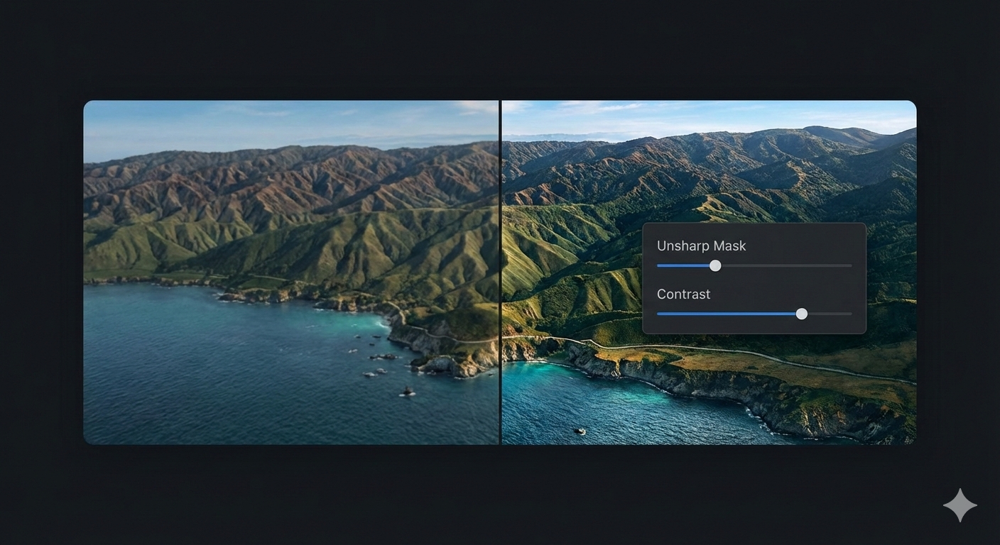

# Advanced Pixel Editor

[](https://github.com/rafael-minuesa/advanced-pixel-editor/releases)
[](https://wordpress.org/plugins/advanced-pixel-editor/)
[](https://php.net/)
[](https://www.gnu.org/licenses/gpl-2.0.html)
[](https://wordpress.org/plugins/advanced-pixel-editor/)

A professional WordPress plugin that brings advanced image editing capabilities directly to your WordPress admin panel. **Requires the ImageMagick PHP extension** for superior image processing. Edit images from your media library with real-time preview, contrast adjustment, unsharp masking, and seamless WordPress integration.

**🚀 Powered by ImageMagick**: This plugin requires the ImageMagick PHP extension for image processing. Imagick is extremely common and should be available on most modern hosting platforms. Enabling Imagick is a significant upgrade for image handling on WordPress sites, leading to better results from plugins and core features.

> **📦 Current Version: 2.9** | **📅 Released: January 28, 2026** | **⚡ WordPress 5.6+ Required**



## ✨ Features

### Professional Image Editing
- **🎨 Real-time Preview**: See filter changes instantly as you adjust sliders
- **🔧 Contrast Adjustment**: Professional contrast control with fine-tuned precision
- **⚡ Unsharp Masking**: Advanced sharpening with full control over amount, radius, and threshold
- **♿ Accessibility**: Full keyboard navigation and screen reader support
- **🔒 Security**: Rate limiting, input validation, and secure file handling
- **🚀 Performance**: Optimized processing with memory management and dimension limits
- **📱 Responsive Design**: Works perfectly on all screen sizes
- **🔗 WordPress Integration**: Seamless media library workflow

### Advanced Features
Looking to process multiple images at once, add watermarks, or use advanced filters? Stay tuned for future updates that will bring even more professional image editing capabilities to WordPress.

## 🎯 Perfect For

- **📸 Photographers and Designers**: Professional image editing tools
- **📝 Bloggers and Content Creators**: Quick image enhancements
- **🛒 E-commerce Stores**: Product image optimization
- **🏢 Corporate Websites**: Brand-consistent image processing
- **👥 Anyone**: Who needs professional image editing in WordPress

## 🚀 Installation

### Prerequisites
**⚠️ Important**: This plugin requires the **ImageMagick PHP extension (Imagick)** to be installed and enabled on your server.

**Imagick is extremely common and should be available on most modern hosting platforms.** If Imagick is not enabled:

1. Contact your web hosting provider
2. Request that they enable the ImageMagick PHP extension
3. Most hosting providers can enable this quickly (usually within hours)
4. **Enabling Imagick is a significant upgrade** for image handling on WordPress sites, leading to better results from plugins and core features

### Installation Steps

1. **Download** the plugin from [WordPress.org](https://wordpress.org/plugins/advanced-pixel-editor/)
2. **Upload** the `advanced-pixel-editor` folder to `/wp-content/plugins/`
3. **Activate** the plugin through the 'Plugins' menu in WordPress
4. **Navigate** to Media → Advanced Pixel Editor to start editing

### Requirements
- **WordPress**: 5.6 or higher
- **PHP**: 7.4 or higher
- **🟡 ImageMagick Extension (Imagick)**: **Required** for image processing

### ⚠️ ImageMagick Extension Setup
**The plugin requires the ImageMagick PHP extension for image processing. Imagick is extremely common and should be available on most modern hosting platforms.**

**Why Imagick?** Enabling Imagick is a significant upgrade for image handling on WordPress sites, leading to better results from plugins and core features. ImageMagick provides superior image processing capabilities compared to GD library.

**If Imagick is not enabled on your server:**

1. **Contact your web hosting provider immediately**
2. Request that they enable the ImageMagick PHP extension
3. Most hosting providers can enable this quickly (usually within hours)
4. If using shared hosting, you may need to upgrade to VPS or dedicated server
5. **This is not optional** - the plugin will not function without Imagick

**Need help?** Contact your webhost provider if Imagick is not installed on your server.

## 📖 Usage

1. **Select Image**: Click "Select Image" to choose from your WordPress media library
2. **Adjust Filters**: Use the intuitive sliders to apply contrast and sharpening
3. **Preview**: See changes in real-time as you adjust the controls
4. **Save**: Click "Save Edited Image" to create a new version in your media library

### Filter Controls

- **Contrast**: Adjusts the difference between light and dark areas (-100 to 100)
- **Sharpness Amount**: Controls the intensity of sharpening (0-5)
- **Sharpness Radius**: Determines how far the sharpening effect spreads (0-10 pixels)
- **Sharpness Threshold**: Sets the minimum contrast level for sharpening (0-1)

## 🤝 Supporting Open Source

This plugin is powered by ImageMagick, the world's most comprehensive free software suite for image processing. ImageMagick has been a cornerstone of digital imaging since 1987, supporting millions of websites and applications worldwide.

[Learn more about ImageMagick](https://imagemagick.org/)

## 📸 Screenshots

1. **Main Editor Interface** - Clean, professional interface with real-time preview
2. **Filter Controls** - Intuitive sliders for contrast and sharpening adjustments
3. **Accessibility Features** - Full keyboard navigation and screen reader support
4. **Media Library Integration** - Seamless workflow with WordPress media library

## 🔧 Frequently Asked Questions

### How do I access the image editor?
Navigate to **Media → Advanced Pixel Editor** in your WordPress admin panel.

### What image formats are supported?
The plugin supports all standard web image formats including JPEG, PNG, GIF, and WebP.

### Is there a limit to image size?
By default, images up to 10MB and 4096×4096 pixels are supported for optimal performance.

### Can I edit images that are already in my media library?
Yes! Select any image from your WordPress media library to edit and enhance.

### Does this plugin create backups of original images?
The plugin saves edited versions as new files in your media library, preserving your originals.

### Is the plugin accessible for users with disabilities?
Yes! The plugin includes full ARIA support, keyboard navigation, and screen reader compatibility.

### Can I use this plugin on mobile devices?
Yes, the editor is fully responsive and works on tablets and mobile devices.

### Does this plugin require any special server configuration?
Yes, the plugin requires the **ImageMagick PHP extension (Imagick)** to be installed and enabled on your server. Imagick is extremely common and should be available on most modern hosting platforms. Contact your web hosting provider if it's not installed - most can enable it quickly (usually within hours). Enabling Imagick is a significant upgrade for image handling on WordPress sites, leading to better results from plugins and core features.

## 🛠️ Development

### Contributing
Contributions are welcome! Please see our [contributing guidelines](https://github.com/rafael-minuesa/advanced-pixel-editor/blob/main/CONTRIBUTING.md) on GitHub.

### Requirements for Development
- WordPress 5.6+
- PHP 7.4+
- Composer for dependency management
- Node.js for asset compilation

### Building Assets
```bash
# Install dependencies
npm install

# Compile assets for development
npm run dev

# Compile assets for production
npm run build
```

## 📊 Changelog

### [2.9] - 2026-01-28
- Added "Advanced Editor" button to Media Library grid view modal (next to "Edit Image")
- Added "Advanced Edit" row action to Media Library list view
- Editor now supports direct image pre-loading via URL parameter from Media Library

### [2.8] - 2025-01-23
- Added draggable comparison slider handle on the image preview
- Clicking anywhere on preview wrapper now moves the comparison slider
- Added touch support for comparison slider on mobile devices
- Filter controls now support negative values (contrast, sharpness amount, radius, threshold)

### [2.7] - 2025-01-21
- Changed plugin slug from "advanced-image-editor" to "advanced-pixel-editor" per WordPress.org review
- Updated text domain, class names, and all file references to match new slug
- Renamed main plugin file to advanced-pixel-editor.php

### [2.6] - 2025-01-21
- Renamed plugin display name from "Advanced Image Editor" to "Advanced Pixel Editor"

### [2.5] - 2025-01-21
- Fixed plugin URI validation issue
- Changed prefix from 'aie' to 'advaimg' to meet WordPress.org guidelines (4+ characters)
- Improved base64 image data sanitization with dedicated validation method
- Renamed internal files to match new prefix convention
- Added build script for WordPress.org submission

### [2.4] - 2025-01-16
- Fixed WordPress.org validation errors
- Improved UI and user experience

### [2.3] - 2025-01-15
- Added preview toggle checkbox to show/hide image preview
- Added before/after comparison slider with draggable handle
- Redesigned layout with preview at top and compact controls sidebar
- Improved responsive design for mobile devices
- Enhanced user interface with better space utilization

### [2.2] - 2025-01-14
- Complete plugin rename from "Advanced Image Filters" to "Advanced Image Editor"
- Enhanced security with rate limiting, input validation, and capability checks
- Improved accessibility with ARIA support and keyboard navigation
- Performance optimizations with memory management and dimension limits
- Better user interface with loading states and progress indicators
- Comprehensive internationalization support
- WordPress coding standards compliance

### [2.1] - 2025-01-10
- Initial release with basic image editing functionality

## 📄 License

This plugin is licensed under the GPL v2 or later.

    Advanced Pixel Editor is free software: you can redistribute it and/or modify
    it under the terms of the GNU General Public License as published by
    the Free Software Foundation, either version 2 of the License, or
    (at your option) any later version.

    Advanced Pixel Editor is distributed in the hope that it will be useful,
    but WITHOUT ANY WARRANTY; without even the implied warranty of
    MERCHANTABILITY or FITNESS FOR A PARTICULAR PURPOSE. See the
    GNU General Public License for more details.

    You should have received a copy of the GNU General Public License along
    with Advanced Pixel Editor. If not, see <https://www.gnu.org/licenses/gpl-2.0.html>.

## 🙏 Credits

**Developed by:** [Rafael Minuesa](https://github.com/rafael-minuesa)

**Built with:**
- Advanced Imagick processing
- Custom WordPress AJAX API
- Secure input validation
- Optimized image processing algorithms

**Special Thanks:**
- ImageMagick community for the powerful image processing library
- WordPress community for the amazing platform

## 📞 Support

### Free Support
- [WordPress.org Support Forums](https://wordpress.org/support/plugin/advanced-pixel-editor/)
- [GitHub Issues](https://github.com/rafael-minuesa/advanced-pixel-editor/issues)

---

*Advanced Pixel Editor brings professional image editing capabilities to the WordPress ecosystem, powered by the Open-Source ImageMagick library.* 🌟